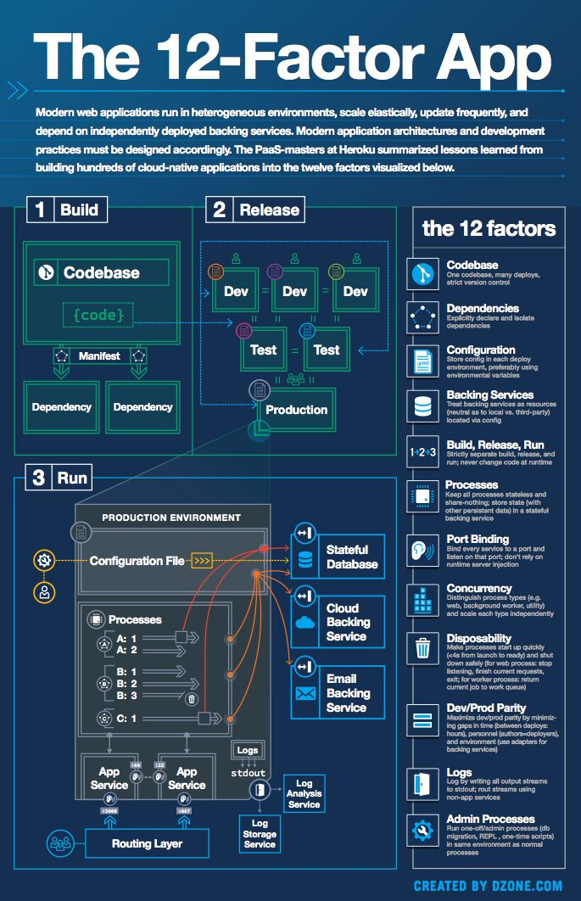
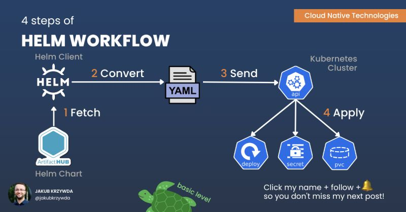
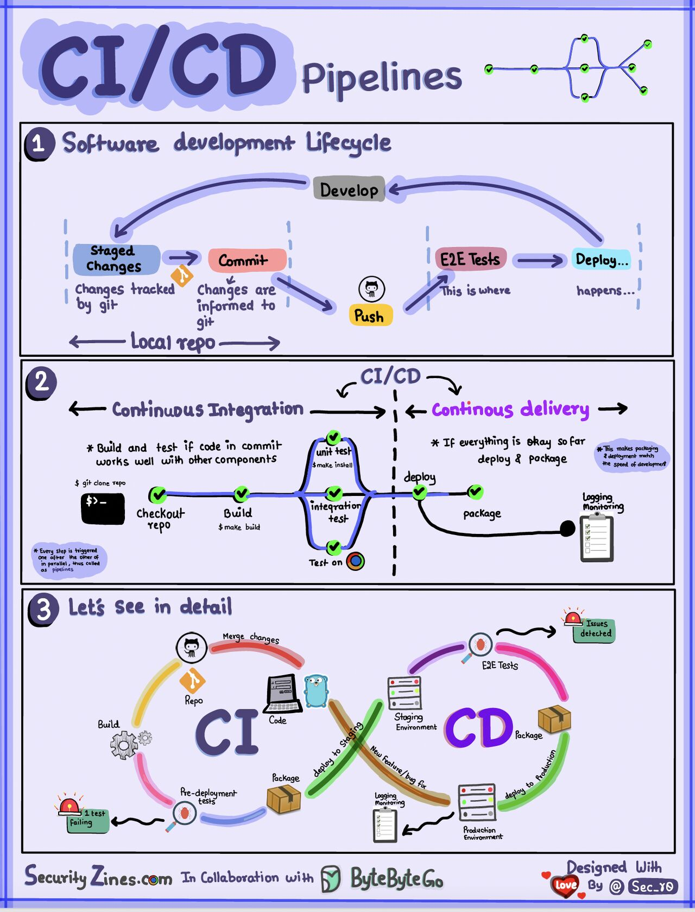

# Temp
 for temporary works & internet resouces

### The 12-Factor App 

  
   

The 12-factor app methodology is a set of best practices for building modern software applications that are scalable, maintainable, and easily deployable. It was originally introduced by Heroku and has since become a widely adopted standard in the software development community. The 12 factors are as follows:

1. Codebase: A single codebase tracked in a version control system, with multiple deployments.
2. Dependencies: Explicitly declare and isolate dependencies. Use dependency management tools.
3. Config: Store configuration in the environment, separate from the code.
4. Backing services: Treat backing services (databases, caches, etc.) as attached resources that can be easily swapped.
5. Build, release, run: Strictly separate the build, release, and run stages of the application lifecycle.
6. Processes: Run the application as one or more stateless processes.
7. Port binding: Export services via port binding. Applications should be self-contained and not rely on runtime injection of a web server.
8. Concurrency: Scale out via the process model. Applications should be able to scale horizontally.
9. Disposability: Maximize robustness with fast startup and graceful shutdown. Processes should be able to start and stop quickly.
10. Dev/Prod parity: Keep development, staging, and production environments as similar as possible.
11. Logs: Treat logs as event streams and provide centralized logging. Application should not concern itself with routing or storage of its output stream.
12. Admin processes: Run admin/management tasks as one-off processes. They should be run in the same environment as the app, with access to the same config and code.

By following these principles, developers can create applications that are easier to develop, test, deploy, and scale, while also improving the overall reliability and maintainability of the software.

### Helm Workflow
⬇️ This is a step-by-step guide to a typical Helm workflow: ⬇️

  
   

Helm is a package manager for Kubernetes. Why do we even need it?

Because application management in Kubernetes can be quite complicated. 

Helm reduces the complexity by introducing Helm Charts, reusable and configurable deployment units for Kubernetes applications.

A typical Helm workflow involves the following steps:

1️⃣ Helm Client 𝐟𝐞𝐭𝐜𝐡𝐞𝐬 Chart package from remote chart repository, such as Artifact Hub.

💲𝘩𝘦𝘭𝘮 𝘱𝘶𝘭𝘭 [𝘙𝘌𝘗𝘖𝘚𝘐𝘛𝘖𝘙𝘠]/[𝘊𝘏𝘈𝘙𝘛]

2️⃣ Helm Client 𝐜𝐨𝐧𝐯𝐞𝐫𝐭𝐬 Chart into a valid Kubernetes resource YAML.

💲𝘩𝘦𝘭𝘮 𝘵𝘦𝘮𝘱𝘭𝘢𝘵𝘦 [𝘙𝘌𝘓𝘌𝘈𝘚𝘌] [𝘊𝘏𝘈𝘙𝘛]

3️⃣ Helm Client 𝐬𝐞𝐧𝐝𝐬 raw YAML contents to the Kubernetes API server over HTTPS.

💲𝘩𝘦𝘭𝘮 𝘪𝘯𝘴𝘵𝘢𝘭𝘭 [𝘙𝘌𝘓𝘌𝘈𝘚𝘌] [𝘊𝘏𝘈𝘙𝘛]

4️⃣ Kubernetes API server 𝐚𝐩𝐩𝐥𝐢𝐞𝐬 desired resources (deployments, secrets, persistent volume claims, etc.).

### CI/CD Pipelines

  
   

Section 1 - SDLC with CI/CD 
The software development life cycle (SDLC) consists of several key stages: development, testing, deployment, and maintenance. CI/CD automates and integrates these stages to enable faster, more reliable releases. 
When code is pushed to a git repository, it triggers an automated build and test process. End-to-end (e2e) test cases are run to validate the code. If tests pass, the code can be automatically deployed to staging/production. If issues are found, the code is sent back to development for bug fixing. This automation provides fast feedback to developers and reduces risk of bugs in production. 
 
Section 2 - Difference between sCI and CD 
Continuous Integration (CI) automates the build, test, and merge process. It runs tests whenever code is committed to detect integration issues early. This encourages frequent code commits and rapid feedback. 
 
Continuous Delivery (CD) automates release processes like infrastructure changes and deployment. It ensures software can be released reliably at any time through automated workflows. CD may also automate the manual testing and approval steps required before production deployment. 
 
Section 3 - CI/CD Pipeline 
A typical CI/CD pipeline has several connected stages: 
- Developer commits code changes to source control 
- CI server detects changes and triggers build 
- Code is compiled, tested (unit, integration tests) 
- Test results reported to developer 
- On success, artifacts are deployed to staging environments 
- Further testing may be done on staging before release 
- CD system deploys approved changes to production 

Source: [CI/CD Pipeline Explained in Simple Terms - by Alex Xu](https://www.linkedin.com/feed/update/urn:li:activity:7092168410834300928/)