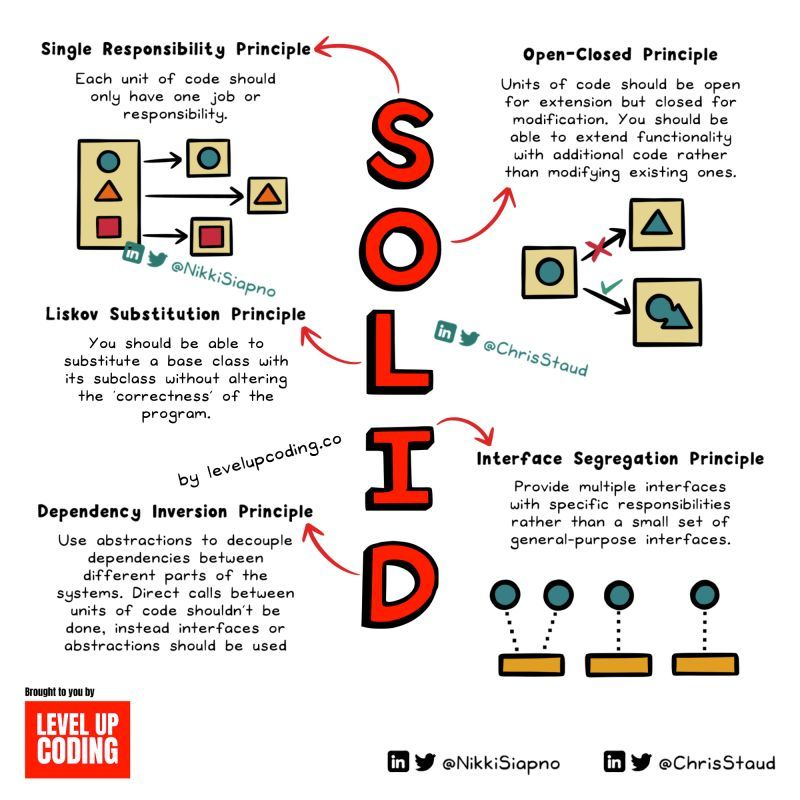

# Temp
 for temporary works & internet resouces

### The 12-Factor App 

  
   

The 12-factor app methodology is a set of best practices for building modern software applications that are scalable, maintainable, and easily deployable. It was originally introduced by Heroku and has since become a widely adopted standard in the software development community. The 12 factors are as follows:

1. Codebase: A single codebase tracked in a version control system, with multiple deployments.
2. Dependencies: Explicitly declare and isolate dependencies. Use dependency management tools.
3. Config: Store configuration in the environment, separate from the code.
4. Backing services: Treat backing services (databases, caches, etc.) as attached resources that can be easily swapped.
5. Build, release, run: Strictly separate the build, release, and run stages of the application lifecycle.
6. Processes: Run the application as one or more stateless processes.
7. Port binding: Export services via port binding. Applications should be self-contained and not rely on runtime injection of a web server.
8. Concurrency: Scale out via the process model. Applications should be able to scale horizontally.
9. Disposability: Maximize robustness with fast startup and graceful shutdown. Processes should be able to start and stop quickly.
10. Dev/Prod parity: Keep development, staging, and production environments as similar as possible.
11. Logs: Treat logs as event streams and provide centralized logging. Application should not concern itself with routing or storage of its output stream.
12. Admin processes: Run admin/management tasks as one-off processes. They should be run in the same environment as the app, with access to the same config and code.

By following these principles, developers can create applications that are easier to develop, test, deploy, and scale, while also improving the overall reliability and maintainability of the software.

### 𝗦𝗢𝗟𝗜𝗗 Principles

  
   

𝗦𝗢𝗟𝗜𝗗 𝗿𝗲𝗽𝗿𝗲𝘀𝗲𝗻𝘁𝘀 𝗳𝗶𝘃𝗲 𝗽𝗿𝗶𝗻𝗰𝗶𝗽𝗹𝗲𝘀 𝗼𝗳 𝗼𝗯𝗷𝗲𝗰𝘁-𝗼𝗿𝗶𝗲𝗻𝘁𝗲𝗱 𝗽𝗿𝗼𝗴𝗿𝗮𝗺𝗺𝗶𝗻𝗴. Whether or not you use OOP, 𝗸𝗻𝗼𝘄𝗶𝗻𝗴 𝘁𝗵𝗲𝘀𝗲 𝗽𝗿𝗶𝗻𝗰𝗶𝗽𝗹𝗲𝘀 𝗴𝗶𝘃𝗲𝘀 𝘆𝗼𝘂 𝗮 𝗹𝗲𝗻𝘀 𝗶𝗻𝘁𝗼 𝘁𝗵𝗲 𝗳𝗼𝘂𝗻𝗱𝗮𝘁𝗶𝗼𝗻𝘀 𝗼𝗳 𝗰𝗹𝗲𝗮𝗻 𝗰𝗼𝗱𝗲 which can be applied to many areas of programming.

𝗦 — Single Responsibility Principle
𝗢 — Open/Closed Principle
𝗟 — Liskov Substitution Principle
𝗜 — Interface Segregation Principle
𝗗 — Dependency Inversion Principle

Let’s break down each principle ↓

𝟭. 𝗦𝗶𝗻𝗴𝗹𝗲 𝗥𝗲𝘀𝗽𝗼𝗻𝘀𝗶𝗯𝗶𝗹𝗶𝘁𝘆 𝗣𝗿𝗶𝗻𝗰𝗶𝗽𝗹𝗲 (𝗦𝗥𝗣)

Each unit of code should only have one job or responsibility. A unit can be a class, module, function, or component. This keeps code modular and removes the risk of tight coupling.

𝟮. 𝗢𝗽𝗲𝗻-𝗖𝗹𝗼𝘀𝗲𝗱 𝗣𝗿𝗶𝗻𝗰𝗶𝗽𝗹𝗲 (𝗢𝗖𝗣)

Units of code should be open for extension but closed for modification. You should be able to extend functionality with additional code rather than modifying existing ones. This principle can be applied to component-based systems such as a React frontend.

𝟯. 𝗟𝗶𝘀𝗸𝗼𝘃 𝗦𝘂𝗯𝘀𝘁𝗶𝘁𝘂𝘁𝗶𝗼𝗻 𝗣𝗿𝗶𝗻𝗰𝗶𝗽𝗹𝗲 (𝗟𝗦𝗣)

You should be able to substitute objects a of base class with objects of its subclass without altering the ‘correctness’ of the program.

An example of this is with a Bird base class. You might assume that it should have a ‘fly’ method. But what about the birds that can’t fly? Like a Penguin. In this example, having a ‘fly’ method in the Bird class would violate LSP.

𝟰. 𝗜𝗻𝘁𝗲𝗿𝗳𝗮𝗰𝗲 𝗦𝗲𝗴𝗿𝗲𝗴𝗮𝘁𝗶𝗼𝗻 𝗣𝗿𝗶𝗻𝗰𝗶𝗽𝗹𝗲 (𝗜𝗦𝗣)

Provide multiple interfaces with specific responsibilities rather than a small set of general-purpose interfaces. Clients shouldn’t need to know about the methods & properties that don't relate to their use case.

Complexity ↓
Code flexibility ↑

𝟱. 𝗗𝗲𝗽𝗲𝗻𝗱𝗲𝗻𝗰𝘆 𝗜𝗻𝘃𝗲𝗿𝘀𝗶𝗼𝗻 𝗣𝗿𝗶𝗻𝗰𝗶𝗽𝗹𝗲 (𝗗𝗜𝗣)

You should depend on abstractions, not on concrete classes. Use abstractions to decouple dependencies between different parts of the systems. Direct calls between units of code shouldn’t be done, instead interfaces or abstractions should be used.

### Helm Workflow
⬇️ This is a step-by-step guide to a typical Helm workflow: ⬇️

  
   

Helm is a package manager for Kubernetes. Why do we even need it?

Because application management in Kubernetes can be quite complicated. 

Helm reduces the complexity by introducing Helm Charts, reusable and configurable deployment units for Kubernetes applications.

A typical Helm workflow involves the following steps:

1️⃣ Helm Client 𝐟𝐞𝐭𝐜𝐡𝐞𝐬 Chart package from remote chart repository, such as Artifact Hub.

💲𝘩𝘦𝘭𝘮 𝘱𝘶𝘭𝘭 [𝘙𝘌𝘗𝘖𝘚𝘐𝘛𝘖𝘙𝘠]/[𝘊𝘏𝘈𝘙𝘛]

2️⃣ Helm Client 𝐜𝐨𝐧𝐯𝐞𝐫𝐭𝐬 Chart into a valid Kubernetes resource YAML.

💲𝘩𝘦𝘭𝘮 𝘵𝘦𝘮𝘱𝘭𝘢𝘵𝘦 [𝘙𝘌𝘓𝘌𝘈𝘚𝘌] [𝘊𝘏𝘈𝘙𝘛]

3️⃣ Helm Client 𝐬𝐞𝐧𝐝𝐬 raw YAML contents to the Kubernetes API server over HTTPS.

💲𝘩𝘦𝘭𝘮 𝘪𝘯𝘴𝘵𝘢𝘭𝘭 [𝘙𝘌𝘓𝘌𝘈𝘚𝘌] [𝘊𝘏𝘈𝘙𝘛]

4️⃣ Kubernetes API server 𝐚𝐩𝐩𝐥𝐢𝐞𝐬 desired resources (deployments, secrets, persistent volume claims, etc.).

### CI/CD Pipelines

  
   

Section 1 - SDLC with CI/CD 
The software development life cycle (SDLC) consists of several key stages: development, testing, deployment, and maintenance. CI/CD automates and integrates these stages to enable faster, more reliable releases. 
When code is pushed to a git repository, it triggers an automated build and test process. End-to-end (e2e) test cases are run to validate the code. If tests pass, the code can be automatically deployed to staging/production. If issues are found, the code is sent back to development for bug fixing. This automation provides fast feedback to developers and reduces risk of bugs in production. 
 
Section 2 - Difference between sCI and CD 
Continuous Integration (CI) automates the build, test, and merge process. It runs tests whenever code is committed to detect integration issues early. This encourages frequent code commits and rapid feedback. 
 
Continuous Delivery (CD) automates release processes like infrastructure changes and deployment. It ensures software can be released reliably at any time through automated workflows. CD may also automate the manual testing and approval steps required before production deployment. 
 
Section 3 - CI/CD Pipeline 
A typical CI/CD pipeline has several connected stages: 
- Developer commits code changes to source control 
- CI server detects changes and triggers build 
- Code is compiled, tested (unit, integration tests) 
- Test results reported to developer 
- On success, artifacts are deployed to staging environments 
- Further testing may be done on staging before release 
- CD system deploys approved changes to production 

Source: [CI/CD Pipeline Explained in Simple Terms - by Alex Xu](https://www.linkedin.com/feed/update/urn:li:activity:7092168410834300928/)

𝐇𝐚𝐯𝐞 𝐲𝐨𝐮 𝐞𝐯𝐞𝐫 𝐰𝐨𝐧𝐝𝐞𝐫𝐞𝐝 𝐡𝐨𝐰 𝐑𝐄𝐒𝐓 𝐀𝐏𝐈 𝐰𝐨𝐫𝐤?

I've been asked this question countless times, and it's one that can lead to fascinating conversations about the backbone of modern software communication.

At its core, 𝐑𝐄𝐒𝐓 (𝐑𝐞𝐩𝐫𝐞𝐬𝐞𝐧𝐭𝐚𝐭𝐢𝐨𝐧𝐚𝐥 𝐒𝐭𝐚𝐭𝐞 𝐓𝐫𝐚𝐧𝐬𝐟𝐞𝐫) is an architectural style that provides a set of constraints for designing networked applications. REST APIs serve as the building blocks for communication between different software components, enabling them to request and exchange data seamlessly.

Here's a simplified breakdown of REST API for you!

𝐑𝐞𝐬𝐨𝐮𝐫𝐜𝐞𝐬: REST revolves around resources, which can be anything from a user profile to a product catalog. Each resource is uniquely identified by a URL, forming the basis for interactions.

𝐇𝐓𝐓𝐏 𝐕𝐞𝐫𝐛𝐬: REST APIs make use of the HTTP methods (GET, POST, PUT, DELETE, etc.) to perform actions on resources. For instance, a GET request retrieves data, while a POST request creates new data.

𝐒𝐭𝐚𝐭𝐞𝐥𝐞𝐬𝐬 𝐂𝐨𝐦𝐦𝐮𝐧𝐢𝐜𝐚𝐭𝐢𝐨𝐧: One of REST's key principles is statelessness. Each request to a REST API should contain all the information needed to understand and process it, making the interactions independent of one another.

𝐔𝐧𝐢𝐟𝐨𝐫𝐦 𝐈𝐧𝐭𝐞𝐫𝐟𝐚𝐜𝐞: REST APIs have a consistent and uniform interface that follows conventions. This predictability simplifies development and integration.

𝐑𝐞𝐩𝐫𝐞𝐬𝐞𝐧𝐭𝐚𝐭𝐢𝐨𝐧: Resources are represented in a format, often JSON or XML. This representation is sent between the client and server to carry information.

𝐂𝐥𝐢𝐞𝐧𝐭-𝐒𝐞𝐫𝐯𝐞𝐫 𝐀𝐫𝐜𝐡𝐢𝐭𝐞𝐜𝐭𝐮𝐫𝐞: REST emphasizes the separation between clients (the user interface) and servers (the data storage and processing), allowing for greater scalability and flexibility.

So, the next time you interact with an app on your smartphone, think about how REST APIs enable it to fetch your latest messages, update your profile, or show you the news. REST is the behind-the-scenes magician that ensures everything works seamlessly.

